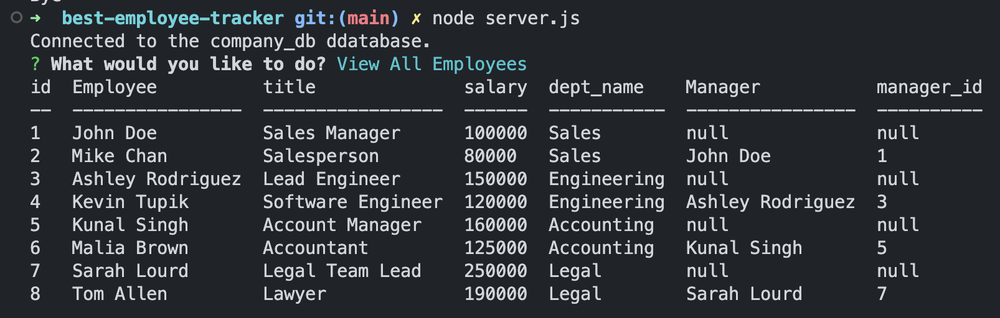

# best-employee-tracker
Command-line application that manages a company's employee database, using Node.js, Inquirer, and MySQL.


## Description
 Application that manages employee's in a SQL database. Users have the choice to add new departments, new roles, and new employees. You also have the choice to view all departments, roles, and employees.

[](n/a)

## Git Hub Repository
https://github.com/tasshroll/best-employee-tracker

## Screenshot

View All Employees



## Walk Through Video
Walkthrough video that demonstrates functionality and all acceptance criteria.

[Click here for video demonstration](https://youtu.be/vosVMQ3ceyI)


## Table of Contents

[Installation](#installation)

[Usage](#usage)


## Installation
 The application uses node.js and Inquirer package to prompt the user for their selection. Node.js interfaces to the database called company_db using mysql2. company_db has three tables: department, role, employee

 To create the environment, database/tables and insert starter data into the tables, type: 
```
    npm i
    npm i inqurer@8.2.4
    mysql
    Once inside mysql, run the 2 SQL files
        source db/schema.sql
        source db/seeds.sql
```
 
 Run the application by typing:
 ```
 node server.js
 ```

## Usage

 User is prompted to choose one of the following
 1) View All Employees, 
 2) Add an Employee,
 3) Update Employee Role,
 4) View All Roles,
 5) Add a Role,
 6) View All Departments
 7) Add Department
 8) Update employee Manager

 Follow the prompts. Choose option QUIT to exit the application.

## User Story

```md
AS A business owner
I WANT to be able to view and manage the departments, roles, and employees in my company
SO THAT I can organize and plan my business
```

## Acceptance Criteria

```
GIVEN a command-line application that accepts user input
WHEN I start the application
THEN I am presented with the following options: view all departments, view all roles, view all employees, add a department, add a role, add an employee, and update an employee role
WHEN I choose to view all departments
THEN I am presented with a formatted table showing department names and department ids
WHEN I choose to view all roles
THEN I am presented with the job title, role id, the department that role belongs to, and the salary for that role
WHEN I choose to view all employees
THEN I am presented with a formatted table showing employee data, including employee ids, first names, last names, job titles, departments, salaries, and managers that the employees report to
WHEN I choose to add a department
THEN I am prompted to enter the name of the department and that department is added to the database
WHEN I choose to add a role
THEN I am prompted to enter the name, salary, and department for the role and that role is added to the database
WHEN I choose to add an employee
THEN I am prompted to enter the employee’s first name, last name, role, and manager, and that employee is added to the database
WHEN I choose to update an employee role
THEN I am prompted to select an employee to update and their new role and this information is updated in the database 
```
## Contributors

Tutor: Jose Lopez